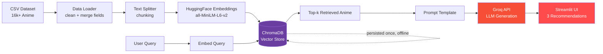

<div align="center">

# 🎌 Anime Recommender System — RAG + LLMOps

**A production-style Retrieval-Augmented Generation system that recommends anime by meaning, not metadata.**

[](https://www.python.org/)
[](https://www.langchain.com/)
[](https://groq.com/)
[](https://www.trychroma.com/)
[](https://streamlit.io/)
[](https://www.docker.com/)
[](https://kubernetes.io/)
[](https://grafana.com/)
[](LICENSE)

[Live Demo]([#](https://anime-rag-recommender-skrsri.streamlit.app/)) · [Report Bug](../../issues) · [Request Feature](../../issues)

</div>

---

## 📌 Overview

Ask for *"a light-hearted anime with a school setting"* in plain English and get back three real, grounded recommendations — each with a synopsis and a reasoned justification for why it fits.

This isn't a wrapper around a chatbot. It's a full **Retrieval-Augmented Generation (RAG)** pipeline built because the only signal available was item text (title, genres, synopsis) — no user rating history — so instead of collaborative filtering, the system does **semantic retrieval over 16,000+ anime**, then hands the retrieved evidence to an LLM to reason over and explain.

It's also fully productionized: containerized with **Docker**, deployed on **Kubernetes**, running on a **GCP VM**, and monitored via **Grafana Cloud** — the complete path from notebook idea to observable, deployed system.

---

## ✨ Why this project stands out

- 🔍 **Semantic, not keyword, search** — finds anime that *mean* what you asked for, even with zero word overlap.
- 🧠 **Grounded generation** — the LLM only recommends from real retrieved matches, with an explicit anti-hallucination instruction baked into the prompt.
- ⚡ **Fast inference** — served through Groq's LPU-backed API for near-instant responses.
- 🧱 **Clean offline/online split** — vector-store construction is a one-time batch job; the serving path only ever does a cheap retrieval + one LLM call.
- ☁️ **End-to-end LLMOps** — Docker → Kubernetes → GCP → Grafana Cloud monitoring, not just a Jupyter notebook.
- 🪵 **Production hygiene** — structured logging and custom exception handling with file/line traceability throughout the pipeline.

---

## 🏗️ Architecture



**Offline (batch, run once):** dataset → cleaning → chunking → embeddings → persisted vector store
**Online (per request):** query → embed → retrieve nearest matches → stuff into prompt → LLM generates → rendered in the app

---

## 🧰 Tech Stack

| Layer | Technology | Purpose |
|---|---|---|
| Language | **Python** | Core implementation |
| Orchestration | **LangChain** | RAG chain composition (retriever + prompt + LLM) |
| Inference | **Groq API** (`openai/gpt-oss-20b`) | Ultra-fast LLM inference on LPU hardware |
| Embeddings | **HuggingFace** (`all-MiniLM-L6-v2`) | Local, free text-to-vector embeddings |
| Vector Store | **ChromaDB** | Persisted semantic search index |
| App Layer | **Streamlit** | Interactive web UI |
| Containerization | **Docker** | Reproducible, portable deployment artifact |
| Orchestration | **Kubernetes** (Minikube) | Self-healing deployment, stable networking |
| Cloud | **GCP Compute Engine** | Hosts the container + cluster |
| Observability | **Grafana Cloud** (via Helm) | Live cluster/pod metrics dashboard |

---

## 📂 Project Structure

```
anime-rag-recommender/
├── app/
│   └── app.py                 # Streamlit UI
├── config/
│   └── config.py               # Env vars, model name
├── src/
│   ├── data_loader.py          # CSV cleaning + merging
│   ├── vector_store.py         # Embedding + ChromaDB build/load
│   ├── prompt_template.py      # RAG prompt
│   └── recommender.py          # RetrievalQA chain
├── pipeline/
│   ├── build_pipeline.py       # Offline: builds the vector store
│   └── pipeline.py             # Online: serves recommendations
├── utils/
│   ├── logger.py                # Structured logging
│   └── custom_exception.py     # Traceable custom errors
├── data/
│   └── anime_with_synopsis.csv
├── Dockerfile
├── llmops-k8s.yaml              # K8s Deployment + Service
├── requirements.txt
└── setup.py
```

---

## 🚀 Getting Started

### Prerequisites
- Python 3.10+
- A free [Groq API key](https://console.groq.com)
- The [Anime Recommendation Database 2020](https://www.kaggle.com/datasets/hernan4444/anime-recommendation-database-2020) dataset (`anime_with_synopsis.csv`)

### Installation

```bash
# Clone the repo
git clone https://github.com/skrsri/anime-rag-recommender.git
cd anime-rag-recommender

# Create and activate a virtual environment
python -m venv venv
source venv/bin/activate        # Windows: venv\Scripts\activate

# Install dependencies
pip install -e .
```

### Configure your environment

Create a `.env` file in the project root:

```
GROQ_API_KEY=your_groq_api_key_here
```

Place the dataset at `data/anime_with_synopsis.csv`.

### Build the vector store (run once)

```bash
python pipeline/build_pipeline.py
```

### Launch the app

```bash
streamlit run app/app.py
```

Open **http://localhost:8501** and start asking for recommendations.

---

## 🐳 Deployment

```bash
# Build the image
docker build -t anime-recommender .

# Run locally
docker run -p 8501:8501 --env-file .env anime-recommender

# Deploy to Kubernetes
kubectl apply -f llmops-k8s.yaml
```

Metrics and cluster health are exposed via a Helm-installed Grafana Cloud agent — see [`llmops-k8s.yaml`](llmops-k8s.yaml) for the full manifest.

---

## 🔭 Roadmap

- [ ] Add an offline evaluation harness (retrieval recall@k, groundedness scoring)
- [ ] Hybrid search (keyword + semantic re-ranking)
- [ ] Swap Chroma for a horizontally-scalable managed vector DB at larger scale
- [ ] CI/CD pipeline for automated image builds on push

---

## 🤝 Connect

**Shikhar Srivastava**
[LinkedIn](https://linkedin.com) · [GitHub](https://github.com/skrsri)

If this project helped you or you found it interesting, consider ⭐ starring the repo!

---

<div align="center">
<sub>Built with LangChain, Groq, and a lot of anime recommendations tested personally.</sub>
</div>
